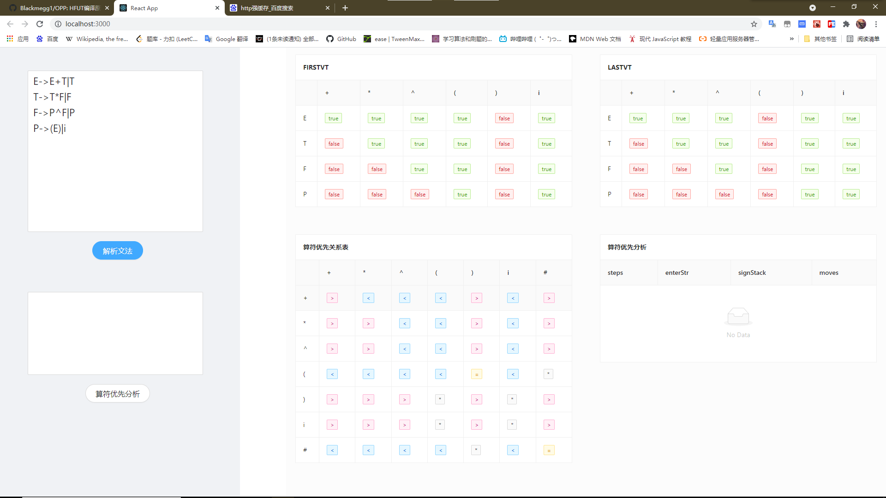

# 说明文档

## 一、功能描述

用户输入任意算符文法G，程序将求出其**FIRSTVT(P)**、**LASTVT(P)**、**优先关系表**并以表格的方式展示在页面上。在求出以上三个表格后，对用户进一步输入的文法输入串，进行算符优先分析，并且展示其“**移进-归约**”过程。

## 二、启动方式

1. 下载该项目release中[build.zip](https://github.com/Blackmegg1/OPP/releases/download/v1.0/build.zip)解压后在该文件夹下运行：`yarn start`，该方式只能展示，代码无法进行二次创作。
2. 使用git clone本仓库，在oppReact文件夹下运行：`yarn start`，该方式适用于代码二次创作。详细的[文件结构](#stru)见下文。

## 三、效果展示

执行环境：

VSCode v1.58.1

yarn v1.22.10

React v17.0.2

初始页面：

用户输入一：

用户输入二：

## 四、文件结构

较为关键的目录有三个：

1. 底层逻辑相关，OPP/oppReact/src/orginSrc

| 文件名         | 作用                         |
| -------------- | ---------------------------- |
| FIRSTVT.js     | 用于求解文法的FIRSTVT        |
| LASTVT.js      | ......                       |
| PRT.js         | 用于求解文法的优先关系表     |
| index.js       | 主函数，通过它来调用其余模块 |
| readAndInit.js | 解析用户输入的文法           |
| resolve.js     | 解析用户输入的表达式         |
| tools.js       | 各个模块中均使用到的工具模块 |

2. 项目主目录，OPP/oppReact/src

| 文件名      | 作用                                             |
| ----------- | ------------------------------------------------ |
| components  | 页面组件                                         |
| orginSrc    | ......                                           |
| App.css     | React根组件样式                                  |
| App.jsx     | React根组件                                      |
| Tableme.jsx | 一个antd表格的演示组件，重点是传给表格的数据格式 |
| index.js    | 执行React渲染                                    |

3. 页面组件目录，OPP/oppReact/src/components

| 文件名称    | 对应组件                             |
| ----------- | ------------------------------------ |
| Btn         | ”解析文法“按钮                       |
| Btn2        | "算符优先分析"按钮                   |
| FIRSTVT     | 展示FIRSTVT的表格                    |
| LASTVT      | ......                               |
| PRT         | ......                               |
| History     | 展示"移进-归约"过程的表格            |
| MyContent   | 页面右侧区域，包含4张表格            |
| MySider     | 页面左侧区域，包含2个输入框和2个按钮 |
| MyTextArea  | 文法输入框                           |
| MyTextArea2 | 表达式输入框                         |

## 五、改前必看

如果你想使用该项目完成编译原理的实验or设计，请认真阅读本部分。

想看懂本项目的所有代码，你至少需要了解：

1. js的基本语法规则，如变量和一些常用的数组方法。[学习链接](https://zh.javascript.info/array-methods)
2. 一点点es6中模块化编程的相关知识。[学习链接](https://zh.javascript.info/modules-intro)
3. 编译原理相关知识。 [课程 P94 - P102](https://www.bilibili.com/video/BV12741147J3?from=search&seid=7727167966753753537)

拥有以上基础，你就可以配合着代码的注释去理解整个项目的底层逻辑部分了，其实十分简单。这里推荐阅读这个无GUI版本的[commit](https://github.com/Blackmegg1/OPP/tree/f3f9d87a6fcf906d17c515a3bd4a1520bc16b5a8)，打开`index.html`，按F12在控制台查看输出。

想要修改本项目的GUI，你至少需要了解：

1. creat-react-app脚手架的文件结构。
2. React的基本语法和组件间通信方法。[学习链接](https://www.bilibili.com/video/BV1wy4y1D7JT)
3. 会查阅antd的官方组件文档。[学习链接](https://ant.design/components/overview-cn/)

拥有以上基础，你就可以试着去修改页面了。注意：我的布局写得很差，除非你对你对CSS布局很了解不然不要轻易修改布局。

本项目其实很简单，并没有复杂得逻辑，祝你使用顺利！:congratulations:

最后，附上写本项目的日记：

## 六、项目日记

2021年7月2日，下雨，断断续续写了2天，到目前为止实现了:triangular_flag_on_post::

1. FIRSTVT
2. LASTVT
3. PRT优先关系表

今天找到了昨天写的两个重要错误:warning:：

1. VT和VN在部分代码中搞反了，VT才是终结符，VN是非终结符 :unamused: ，实在太蠢了
2. 之前用是否是小写来筛选终结符，事实证明偷懒是没有好下场的，重新写了`isVT`函数，并考虑了`undefined`和字符串情况

今天实现了个不错的想法：

在工具模块`tools`中写了个叫`decorate2DArray`的函数，代码很简洁，作用是为二维数组加上行头和列头，输出调试的时候再也不会看不懂二维数组。而且因为相当于装饰函数，所以想去掉得到纯数据时只需要删除这个调用就可以了，应该会有不错的效果。

------

2021年7月4日，下带雨，第三天完成了所有功能，今天实现:triangular_flag_on_post:：

1. 算符优先分析过程

今天修复了前天写的两个错误:warning:：

1. 调整了`decorate2DArray`函数的位置，现在不会因为提前装饰了FIRSTVT和LASTVT而导致在求PRT的过程中发生错误。
2. 修改了`findVTindex`函数，现在它可以正确地找到“#”的索引（即VTarr.length）。是否应该在一开始就将"#"算入VTarr？这个问题我至今很模糊，网课上也没有说得很清楚，感觉它是在求PRT时突然加入的，所以会产生一些冲突。

晚上写完页面就完成了。

------

2021年7月5日，毛毛雨，第四天终于开始写界面了，今天实现:triangular_flag_on_post:：

1. 学会了使用[antd ](https://ant.design/index-cn):ant:，之前不会react时总觉得很难，今天发现挺简单的:happy:
2. 为了使数据契合antd中Table组件的接受格式，我将我之前”引以为傲“二维数组展示形式推倒了，重新编写了`generateColumns`和`generateDataSource`这两个工具函数生成新的数据格式。我想一定有人写了二维数组转json数组的轮子，但我没找到，而且我的数据比较特别，索性就自己写了。说真的这段代码写得挺臭的:disappointed_relieved:，即使有注释我过几天也一定看不懂了。(主要还是前期的准备工作没有做好，数据结构设计漏洞较多，后面打的补丁多)

今天发现的大问题:warning:：

1. ”#“真的太折磨人了，每次改动都要单独考虑它，再给我一次机会我一定一开始就将它算作VT

今晚加把劲试试能不能把界面搞定吧，如果可以全部搞完也好。

------

2021年7月5日，晚：

1. 收回几个小时前说的话，antd真复杂，修改组件样式真让人崩溃:disappointed:
2. 把history给处理好了，因为它相较于其他3个表格不太一样所以单独写了处理函数，代码又变复杂了
3. 页面基本搭建好了，就差把数据与组件绑定，这是个挑战，希望明天可以完成
4. 有钱一定要买一个全SSD的电脑:computer:，HDD传输React工程真的是太慢了(因为node-modules文件又小又多)，300MB能传10min，git add 一次等十多分钟:clock10:，搞得我只能将所有的React工程放入128GB的SSD

------

2021年7月6日，阴天，上午停水:droplet:，今天重点攻克React写的展示界面：

1. 完成了文法和表达式的接受和解析页面组件的编写，并实现了它们深层的逻辑。（其实很简单）
2. 如React官方建议的那样，我没有使用`ref`，逼迫自己尝试”状态提升“这个处理方式
3. 将之前所有的代码命名为`originSrc`文件夹，以模块的方式与React结合。本次课设对我js模块化编程能力提升很多。

今天的不足：

1. 放弃了之前使用的antd的`Layout`和`Row`，因为修改antd自带组件的样式实在太麻烦了，转而通过自己创组件然后内套antd组件的方式，样式方面更加可控，但算是逃课，以后还要补上来的。
2. 组件通信仍然不熟练，实现过程中出现大量的数据重复（同一份数据多个拷贝）。
3. 初始数据问题仍然存在，表现为某个对象为undefined，组件渲染时读取其属性报错。
4. FIRSTVT和LASTVT部分内容显示为空，因为部分数据为boolean类型，展示出来为空白，这个明天作为第一个任务解决，尽量美观呈现数据。
5. 变量命名不规范，很容易记混。

------

2021年7月9日，大大大大雨:cloud_with_rain:，今天完成了操作系统验收和展示页面的编写，修复了两个问题：

1. 修护了输入文法末端多出回车会导致错误的问题，这个是因为在最初处理输入数据时并没有考虑到用户的意外输入。
2. 解决了History表格重渲染后会导致PRT表格下沉的问题，解决方案就是为PRT加上`postion:fixed`， 我推断这是由于在最原始的文档流中，React重渲染History表格并为其加上新的行之后，PRT没有“响应到”这些新DOM元素的加入，所以会发生位置下沉，为它加了fixed后就脱离了标准文档流。总之，在css的布局上我欠缺很多，都没有系统地去学习布局，需要赶紧补缺。

明天就最后调整样式，然后学习打包发布。

------

2021年7月10日，晴:sun_with_face:，今天早起，没有对代码做更改。

发布了v1.0，过程比想象中简单很多，由于我用的脚手架直接运行yarn build就可以了。倒是思考了下如何在build文件夹下运行项目，结果只要yarn start就可以了。看来脚手架真的帮我完成了所有工作啊，真的很方便。虽然发布了v1.0但是还有很多改进地空间，比如：

1. 测试数据单独写在 input.txt 中，这太low了，争取v1.1版本让用户可以直接在主页面选择测试数据。
2. 页面渲染太过唐突，4张表格都是突然出现，棱角分明，没有过渡让人看起来很不舒服。
3. 之前考虑增加的步骤条组件没有加入。

这些完善会在我写完操作系统报告+编译原理报告+大数据两个报告后进行。
